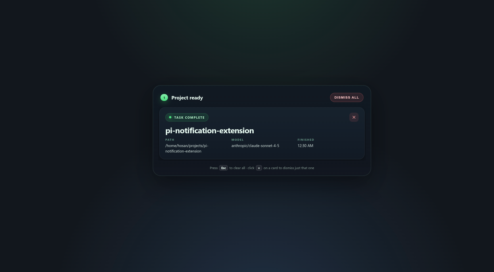

# Pi Notification Extension

A small two-part project that turns Pi task completion events into a fullscreen browser overlay.

## Structure

- `extension/` — Plasmo + React + TypeScript Chrome extension
- `relay/` — local Express + WebSocket relay server that receives Pi completion events and pushes them to the extension

## What it does

When a Pi agent run completes:

1. Pi shows the native desktop/terminal notification.
2. Pi POSTs the completion payload to the relay (`POST /notify`).
3. The relay broadcasts that event over its WebSocket to every connected client.
4. The Chrome extension stores the active notification and shows a fullscreen overlay in normal browser tabs.
5. Closing the overlay in one tab clears it everywhere.

## Preview



The overlay floats above whatever page you're on. Each completed run becomes a card with the project path, the model that ran, and a finish time. Press `Esc` to clear them all, or click the × on a single card to dismiss just that one.

## Browser behavior

The overlay covers the full page viewport inside normal tabs (`http://` / `https://`).
It cannot cover restricted browser pages such as `chrome://*` or the Chrome Web Store.

---

## Quick start

### Prerequisites

- **Node.js 20+**
- **pnpm 10+** (this repo is a pnpm workspace; `corepack enable` or `npm i -g pnpm` both work)

### 1) Clone & install

```bash
git clone https://github.com/<your-fork-or-org>/pi-notification-browser-extension.git
cd pi-notification-browser-extension
pnpm install
```

This installs dependencies for both `extension/` and `relay/` via the workspace.

### 2) Configure the relay

The relay needs an API key to start. Copy the example file and edit it:

```bash
cp relay/.env.example relay/.env
```

Open `relay/.env` and set at least:

```dotenv
# Required — shared secret. Pick anything strong, you'll paste the same
# value into the extension settings later.
PI_NOTIFICATION_RELAY_API_KEY=replace-with-a-long-random-string

# Optional — defaults shown
# PI_NOTIFICATION_RELAY_PORT=48291
# PI_NOTIFICATION_RELAY_HOST=127.0.0.1
# NODE_ENV=development
```

> The relay **will refuse to start** without `PI_NOTIFICATION_RELAY_API_KEY`. This is intentional.

### 3) Start the relay

```bash
pnpm dev:relay
```

You should see:

```text
[relay] listening on http://127.0.0.1:48291
```

Default endpoints:

| Method | Path        | Auth required | Purpose                          |
|--------|-------------|---------------|----------------------------------|
| GET    | `/ping`     | no            | Liveness probe (used by popup)   |
| GET    | `/health`   | yes           | Authenticated health check       |
| GET    | `/active`   | yes           | Current active notification     |
| POST   | `/notify`   | yes           | Push a notification              |
| POST   | `/dismiss`  | yes           | Clear the active notification    |
| WS     | `/`         | yes           | Realtime push to clients         |

Authenticated requests must send `x-api-key: <your-key>`. WebSocket clients can pass it either as that header or as `?api_key=…` on the URL (browsers can't set custom headers during the WS handshake).

### 4) Build & load the extension

```bash
pnpm build:extension
```

Then in Chrome:

1. Open `chrome://extensions`.
2. Toggle **Developer mode** (top-right).
3. Click **Load unpacked**.
4. Choose the folder:
   ```text
   extension/build/chrome-mv3-prod
   ```

Pin the extension to your toolbar so the popup is one click away.

> Prefer hot-reload while developing? Use `pnpm dev:extension` and load `extension/build/chrome-mv3-dev` instead.

### 5) Configure the extension

The extension **no longer reads any `.env` file**. All settings live in `chrome.storage.local` and are configured through the UI.

1. Click the extension icon in the Chrome toolbar.
2. The popup shows the current **relay status** (Connected / Offline / Unauthorized / Missing API key / etc.).
3. Click the ⚙️ gear icon (top-right) or the **Settings** button.
4. The options page opens in a new tab. Fill in:
   - **Relay URL** — defaults to `http://127.0.0.1:48291`. Change this if you host the relay somewhere else (e.g. `https://relay.example.com`).
   - **x-api-key** — paste the **exact same value** you put into `relay/.env`. This field is empty by default; the extension will stay disconnected until you fill it in.
5. Click **Save settings**.

The background service worker automatically reconnects with the new values. Re-open the popup — the status dot should turn green and read **Connected**.

### 6) Wire up Pi

Your Pi extension at:

```text
~/.pi/agent/extensions/project-finish-notify.ts
```

should POST the completion payload to the relay. Configure it with:

```bash
export PI_BROWSER_NOTIFICATION_RELAY_URL="http://127.0.0.1:48291/notify"
export PI_BROWSER_NOTIFICATION_RELAY_API_KEY="same-key-as-relay-.env"
```

Then `/reload` inside Pi (or restart Pi).

### 7) Try it out

Trigger any Pi task completion. You should see:

- the native Pi notification, **and**
- a fullscreen overlay in every open Chrome tab.

You can also fire a test notification by hand:

```bash
curl -X POST http://127.0.0.1:48291/notify \
  -H 'content-type: application/json' \
  -H 'x-api-key: replace-with-a-long-random-string' \
  -d '{
    "id": "test-1",
    "projectName": "Hello world",
    "projectPath": "/tmp/hello",
    "model": "anthropic/claude-sonnet-4-5"
  }'
```

Dismiss it from inside the overlay (× on the card, or `Esc` to clear all), or via:

```bash
curl -X POST http://127.0.0.1:48291/dismiss \
  -H 'content-type: application/json' \
  -H 'x-api-key: replace-with-a-long-random-string' \
  -d '{"id":"test-1"}'
```

---

## Settings reference

### Relay (`relay/.env`)

| Variable                          | Required | Default       | Purpose                                  |
|-----------------------------------|----------|---------------|------------------------------------------|
| `PI_NOTIFICATION_RELAY_API_KEY`   | ✅       | —             | Shared secret enforced on every authenticated route + WS handshake |
| `PI_NOTIFICATION_RELAY_PORT`      | ❌       | `48291`       | TCP port to bind                         |
| `PI_NOTIFICATION_RELAY_HOST`      | ❌       | `127.0.0.1`   | Interface to bind (`0.0.0.0` for LAN)    |
| `NODE_ENV`                        | ❌       | `development` | Standard Node env flag                   |

### Extension

The extension's settings live in `chrome.storage.local` under the key `piExtensionSettings` — edit them via the in-extension UI (toolbar icon → ⚙️ Settings). There is **no** `.env` to fill out on the extension side.

| Setting     | Default                     | Purpose                                                       |
|-------------|-----------------------------|---------------------------------------------------------------|
| Relay URL   | `http://127.0.0.1:48291`    | Base HTTP(S) URL of the relay (extension derives `ws(s)://`)  |
| x-api-key   | _(empty)_                   | Must match the relay's `PI_NOTIFICATION_RELAY_API_KEY`        |

The popup's status indicator distinguishes four failure modes so you can debug at a glance:

| Dot color | Label             | Meaning                                                |
|-----------|-------------------|--------------------------------------------------------|
| 🟢 Green  | **Connected**     | Relay reachable, key valid, WebSocket open             |
| 🟡 Amber  | **Not configured** / **Missing API key** / **Connecting…** | Settings incomplete or WS still negotiating |
| 🔴 Red    | **Offline**       | `/ping` failed — relay process not running             |
| 🔴 Red    | **Unauthorized** / **Invalid API key** | `/health` returned 401/403 — key mismatch |

---

## Payload shape

```json
{
  "id": "unique-id",
  "title": "Task complete",
  "projectName": "my-project",
  "projectPath": "/home/hosan/projects/my-project",
  "model": "anthropic/claude-sonnet-4-5",
  "timestamp": 1712345678901
}
```

Only `id` and `projectPath` are required when POSTing to `/notify` — the relay fills in sensible defaults for everything else.

---

## Available scripts

Run from the repository root:

| Command                       | What it does                                                   |
|-------------------------------|----------------------------------------------------------------|
| `pnpm dev:relay`              | Run the relay with `tsx watch` (hot reload)                    |
| `pnpm build:relay`            | Compile the relay to `relay/dist`                              |
| `pnpm start:relay`            | Run the compiled relay (`node relay/dist/index.js`)            |
| `pnpm dev:extension`          | Plasmo dev mode for the extension (`extension/build/chrome-mv3-dev`) |
| `pnpm build:extension`        | Production build (`extension/build/chrome-mv3-prod`)           |
| `pnpm package:extension`      | Produce the distributable `.zip`                               |

---

## Troubleshooting

**Popup says "Offline"**
→ The relay isn't running. Start it with `pnpm dev:relay`. Check that the port in the popup matches `PI_NOTIFICATION_RELAY_PORT`.

**Popup says "Invalid API key" / "Unauthorized"**
→ The value in **extension settings → x-api-key** doesn't match `PI_NOTIFICATION_RELAY_API_KEY` in `relay/.env`. Copy-paste them again exactly. Whitespace counts.

**Popup says "Missing API key"**
→ You haven't entered the key in the extension yet. Click the gear icon and fill it in.

**Pi runs complete but no overlay appears**
→ Confirm Pi is hitting the right URL/key:
```bash
echo $PI_BROWSER_NOTIFICATION_RELAY_URL
echo $PI_BROWSER_NOTIFICATION_RELAY_API_KEY
```
And verify the relay is logging the incoming `[relay] notify …` line.

**Overlay doesn't appear on `chrome://` pages or the Chrome Web Store**
→ Expected. Chrome forbids content scripts on restricted pages. Switch to any other tab.

**WebSocket disconnects loop in dev tools**
→ Almost always an API-key mismatch. Save the correct key in extension settings; the background worker will reconnect automatically.

---

## Extension releases

Releases are driven by version tags. Push a Chrome-compatible semver tag from the latest `main` commit:

```bash
git checkout main
git pull --ff-only
git push origin main
git tag v0.0.4
git push origin v0.0.4
```

The **Publish Extension** workflow uses the pushed tag as the requested version. It generates release notes from commits since the previous `vX.Y.Z` tag, updates `extension/package.json`, writes the `CHANGELOG.md` entry, commits those release files to `main`, retargets the tag to that release commit, then builds and publishes the extension.

The publish workflow installs dependencies with pnpm, builds the Plasmo extension, packages `extension/build/chrome-mv3-prod.zip`, uploads it as a workflow artifact, and creates or updates a GitHub release with the changelog notes.

To also publish to browser extension stores, add a repository secret named `BPP_KEYS` containing the Plasmo Browser Platform Publisher JSON credentials. If `BPP_KEYS` is absent, the workflow still publishes the GitHub release zip and skips store publishing.
